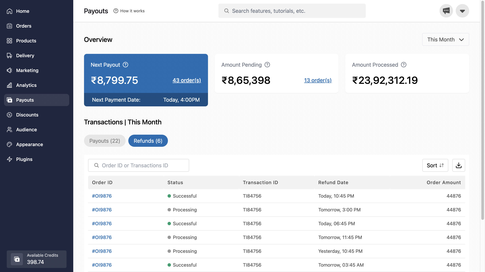
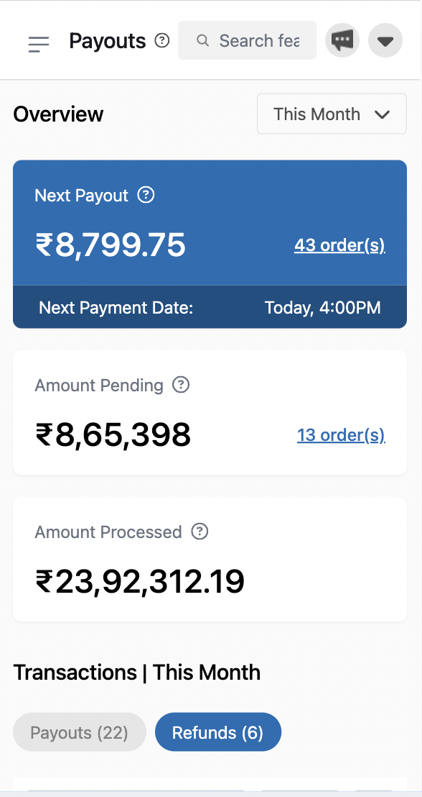

# React + Tailwind + Vite Dashboard Application

This is a one-page dashboard application built with React.js, Tailwind CSS, and Vite.

## Features
- **Responsive Design:** Optimized for various screen sizes, including mobile devices.
- **Easy Customization:** Tailwind CSS enables easy customization and theming.
- **Fast Development:** Utilizes Vite for fast development and hot module replacement.

## Technologies Used
- **React.js:** A JavaScript library for building user interfaces.
- **Tailwind CSS:** A utility-first CSS framework for rapid UI development.
- **Vite:** A blazing fast frontend build tool that provides instant server start and hot module replacement.

## Getting Started

1. Clone the repository: git clone https://github.com/Garvjeet/dashboard-tailwind-react
2. cd [your-repository-folder] 
3. npm install
4. npm run dev

